# Programos naudojimo instrukcija

Programos esmė — apdoroti ar generuoti studentų duomenis.

Programa turi 6 skirtingas eigas, matomas pradiniame programos meniu:

1. Studentų duomenų įvedimas iš duomenų failo

- Naudotojas gali pasirinkti aplanke "ivesties_failai" esančius tekstinius failus (jeigu jų yra) su studentų duomenimis (vardu, pavarde, pažymiais), apdoroti failą ir išvesti rezultatus (apie apdorojimą, išvedimą žr. žemiau).

2. Studentų ir jų pažymių įvedimas ranka

- Naudotojas gali pats ranka įvesti norimą skaičių studentų ir jų pažymius, duomenys apdorojami ir išvedamas rezultatas.

3. Studentų duomenų įvedimas ranka ir jų pažymių sugeneravimas

- Naudotojas gali ranka įvesti norimą skaičių studentų ir sugeneruoti jiems norimą skaičių pažymių, duomenys apdorojami ir išvedamas rezultatas.

4. Studentų ir jų pažymių sugeneravimas

- Naudotojo pageidavimu gali būti sugeneruojamas norimas skaičius studentų su norimu skaičiumi pažymių, duomenys apdorojami ir išvedamas rezultatas.

5. Studentų ir jų pažymių išvedimas į failą

- Naudotojo pageidavimu gali būti sugeneruojamas norimas skaičius studentų su norimu skaičiumi pažymių ir duomenys išvedami į failą.

6. Programos baigimas

Duomenų apdorojimas ir išvedimas:

- Įvedus ar sugeneravus studentų ir jų pažymių duomenis, naudotojas gali pasirinkti galutinio vertinimo skaičiavimo būdą (pagal vidurkį arba medianą), pasirinkti studentų surikiavimą išvestyje (pagal vardą, pavardę, galutinį balą (vidurkį/medianą) arba nerikiuoti) ir pasirinkti išvesties failo pavadinimą. Rezultatas (lentelės pavidalo) išvedamas folderyje isvesties_failai į tekstinį failą su naudotojo pageidautu pavadinimu.

# Paleidimo instrukcija

- Atsisiųsti programos kodą (failai prisegti prie šio programos leidimo);
- Atidaryti komandinę eilutę programos aplanke;
- Įvesti komandą "make" (arba kitą jūsų turimo kūrimo įrankio komandą, pvz.: "mingw32-make", jei naudojate MinGW paketą), ją įvykdžius bus sukurtas programos paleidžiamasis failas;
  - (šiam žingsniui įvykdyti kompiuteryje turi būti įdiegtas kuris nors programų sukūrimo įrankis, pvz., MinGW-w64, MSVC)
- Įvesti "./bin/programa" arba "make run" (ar "mingw32-make run"), taip bus paleista programa (bus matomas programos pradinis meniu).

Pastaba: programos paleidimas pritaikytas Windows operacinei sistemai.

# Programos kodas

### Programos kode perdengti metodai

Programoje naudojamoje studento klasėje jos naudotojų patogumui perdengti kai kurie operatoriai:

- išvesties srauto operatorius (<<): šis operatorius pritaikytas tiesiogiai išvesti studento klasės objektus į terminalą ar į failą;
- įvesties srauto operatorius (>>): šis operatorius pritaikytas įvesti duomenis į studento objektą;
- priskyrimo operatorius (=): šis operatorius pritaikytas studento klasės kintamajam priskirti tiek kopijuote (copy assignment), tiek perkelte (move assignment).

Taip pat klasėje papildomai perdengti ir konstruktorių metodai, pridėti kopijavimo ir perkėlimo konstruktoriai.

# Programos leidimai

## v2.0

### Dokumentacija

- Naudojantis Doxygen įrankiu sukurta dokumentacija.
- Dokumentacija prieinama tiek HTML, tiek LaTeX, tiek PDF formatais.

## v1.5

### Klasių pertvarkymas

- Programoje sukurta abstrakti žmogus klasė, iš kurios paveldi studento klasė.
- Programos funkcionalumas išlaikytas lygiai toks pat.

## v1.2

### Metodų papildymas

- Programoje naudojama studento klasė papildyta naujais metodais: kopijavimo ir perkėlimo konstruktoriais, kopijavimo ir perkėlimo priskyrimo operatorių bei įvesties ir išvesties operatorių perdengimais.

### Testai

- Programa papildyta paruoštais kodo veikimo testais: paruošti testai šioje versijoje pridėtiems naujiesiems studento klasės metodams, skirti patikrinti jų tinkamą veikimą.

## v1.1

### Perėjimas prie klasių

- Programos kode pereita nuo struktūrų naudojimo prie klasių naudojimo.

### Testavimai

- README.md faile aprašytas programos trukmės tyrimas, kuriame lyginama programos trukmė priklausomai nuo: klasių ar struktūrų naudojimo, kompiliatoriaus optimizavimo lygmens (O1, O2, O3). Taip pat palygintas ir šių skirtingų programos versijų paleidžiamųjų (.exe) failų dydis.

## v1.0

### Programos paruošimas

- Programa labiau paruošta naudojimui. README.md faile įtrauktas programos aprašas, naudojimosi, paleidimo instrukcijos.

### Optimizavimas

- Šiek tiek pagerintas programos veikimo laikas.
- Atlikti išsamūs programos trukmės testavimai įvairiomis sąlygomis (įvairiais duomenų kiekiais, kode naudojamais konteineriais). Testavimų rezultatai įtraukti į projekto README.md failą.

## v1.0 pradinė

### Skirtingi konteineriai

- Programos kodas pritaikytas trims skirtingiems duomenų konteineriams: std::vector, std::deque, std::list.

### Optimizavimas

- Pagerintas programos veikimas: pagerinta programos sparta ir atminties naudojimas.
- Programos versijų su skirtingais konteineriais trukmės testavimas aprašytas README.md faile.

## v0.4

### Failų generavimas

- Pridėtas visų studentų duomenų (įskaitant ir paskirus pažymius) failo generavimo funkcionalumas.

### Studentų išvesties skirstymas

- Studentų duomenys išvedami į du atskirus failus, atrenkant pagal studentų galutinį įvertinimą — vidurkį/medianą (< 5.0 vienur, >= 5.0 kitur).

### Programos trukmės matavimas

- Programoje pridėti nauji programos etapų trukmės matavimai (failų kūrimo ir apdorojimo).
- Programos trukmės testavimo skirtingais krūviais aprašas pridėtas į projekto README.md failą.

## v0.3

### Pakeitimai:

- Projektas suskaidytas į atskirus savo paskirties failus;
- Programoje pridėta daugiau išimčių valdymo;
- Programos funkcijos tapo labiau struktūruotos.

## v0.2

### Failų funkcionalumas

- Pridėta galimybė duomenis nuskaityti iš pasirinkto failo.
- Įtraukta galimybė išvestyje studentus surūšiuoti pagal pasirinktą parametrą: vardą, pavardę, galutinį pažymį (vidurkio ar medianos); didėjimo ar mažėjimo tvarka.
- Pridėta programos išvestis į failą.

## v0.1

### Meniu

Pridėtas programos meniu, siūlantis 4 skirtingas programos eigas:

- rankinis visų duomenų įvedimas;
- rankinis vardų įvedimas, pažymių sugeneravimas;
- visų duomenų sugeneravimas;
- programos baigimas.

## v.pradinė

Pradinės versijos programa, kuri:

- nuskaito studentų duomenis (vardą, pavardę, pažymius, egzaminų įvertinimą);
- apskaičiuoja galutinį balą (pagal vidurkį arba medianą);
- pateikia visus reikalingus duomenis lentelėje.

# Programos trukmės testavimai

Programos trukmė išmatuota dviem programos versijoms: struktūrų ir klasių versijoms. Testavimai atlikti kiekvienai versijai su 3 skirtingais kompiliatoriaus optimizavimo lygmenimis (O1, O2, O3), su 100 tūkst. ir 1 mln. studentų įrašų apdorojimu, kiekvieną bandymą kartojant 5 kartus. Visuose testavimuose naudojamas konteineris — std::vector, studentų skirstymo strategija — 3.

Testavimo sistemos parametrai:

- CPU: AMD Ryzen 5 4600H 3GHz
- RAM: 16 GB
- SSD: Lexar SSD NM710 1TB

## Klasių versija

### O1

Paleidžiamojo (.exe) failo dydis: 245 KB

##### 100 tūkst. įrašų:

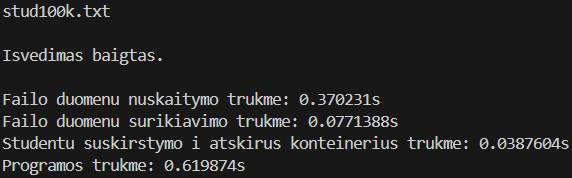
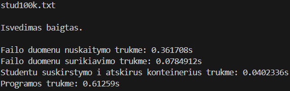
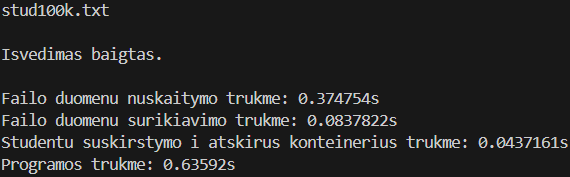
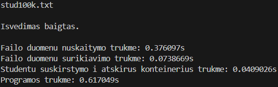
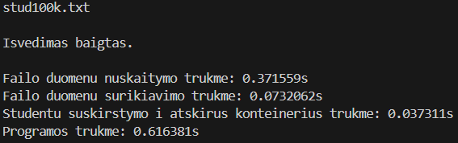

##### 1 mln. įrašų:

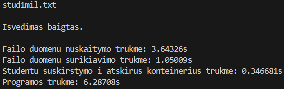
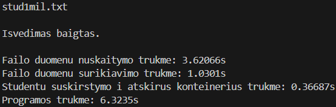
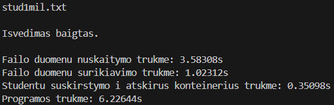
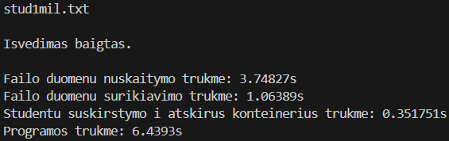
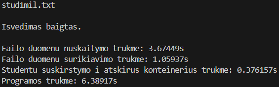

### O2

Paleidžiamojo (.exe) failo dydis: 257 KB

##### 100 tūkst. įrašų:

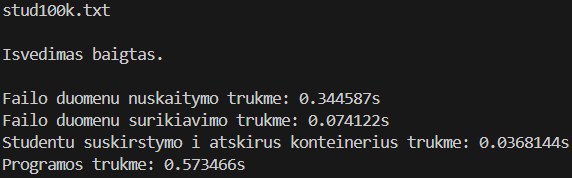
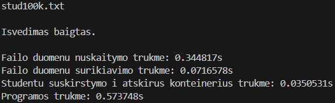
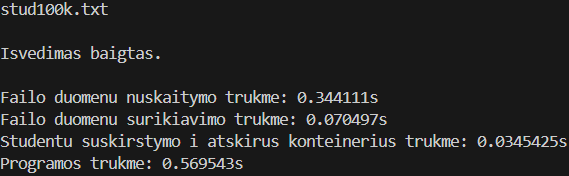

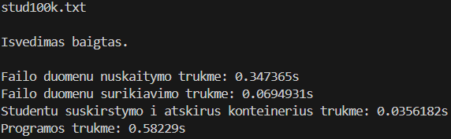

##### 1 mln. įrašų:

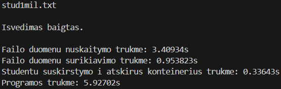
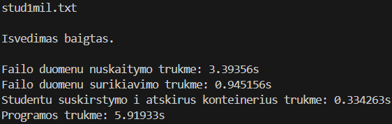
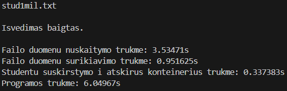
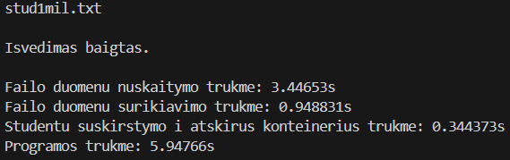
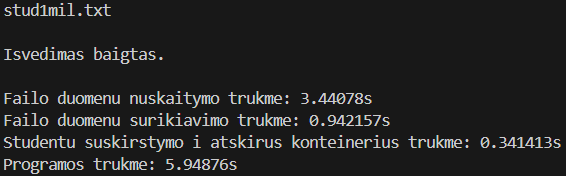

### O3

Paleidžiamojo (.exe) failo dydis: 298 KB

##### 100 tūkst. įrašų:

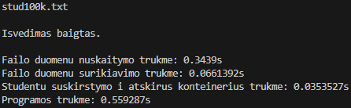
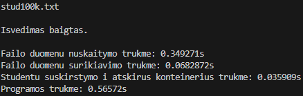
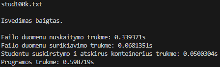
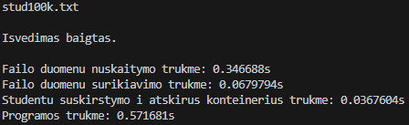
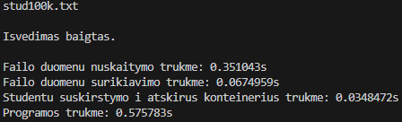

##### 1 mln. įrašų:

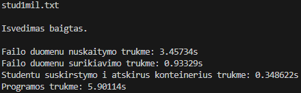
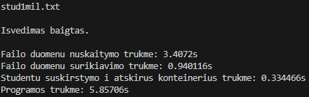
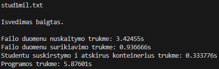
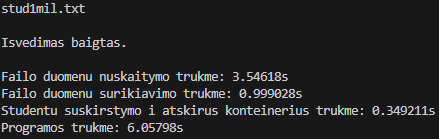
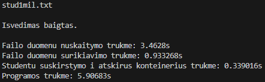

## Struktūrų versija

### O1

Paleidžiamojo (.exe) failo dydis: 255 KB

##### 100 tūkst. įrašų:

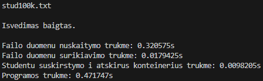
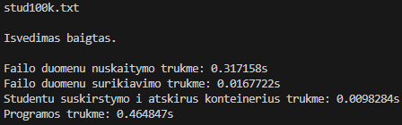
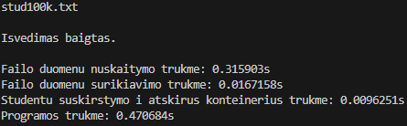
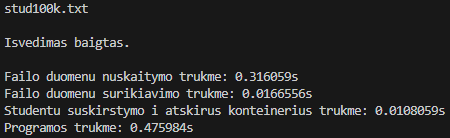
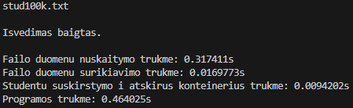

##### 1 mln. įrašų:

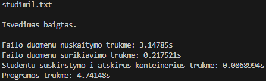
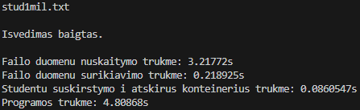
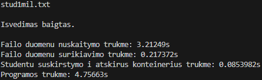
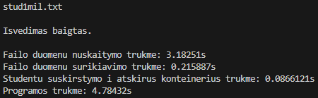
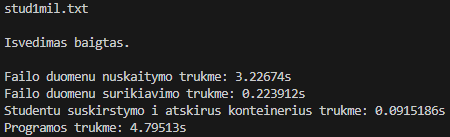

### O2

Paleidžiamojo (.exe) failo dydis: 250 KB

##### 100 tūkst. įrašų:

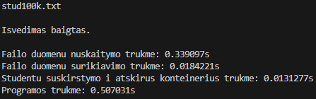
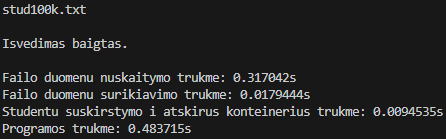
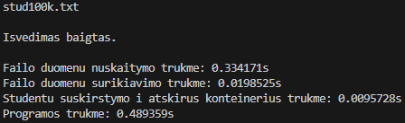
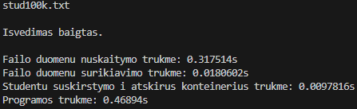
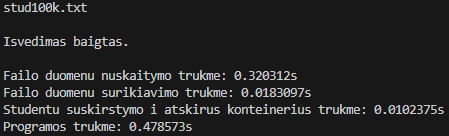

##### 1 mln. įrašų:

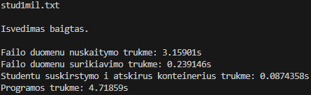
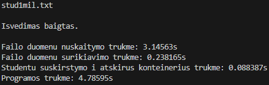
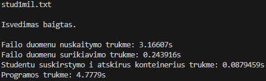
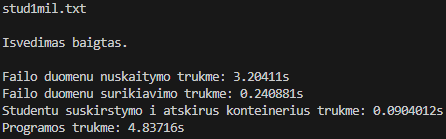
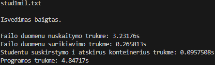

### O3

Paleidžiamojo (.exe) failo dydis: 300 KB

##### 100 tūkst. įrašų:

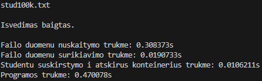

##### 1 mln. įrašų:

## Išvados

### Klasių versija:

##### Su O1:

| Failo įrašų sk.   | 100 tūkst. | 1 mln.    |
| ----------------- | ---------- | --------- |
| Nuskaitymas (s)   | 0,3708698  | 3,6539520 |
| Surikiavimas (s)  | 0,0772971  | 1,0453140 |
| Išskirstymas (s)  | 0,0401847  | 0,3584878 |
| Visa programa (s) | 0,6203628  | 6,3330980 |

##### Su O2:

| Failo įrašų sk.   | 100 tūkst. | 1 mln.    |
| ----------------- | ---------- | --------- |
| Nuskaitymas (s)   | 0,3466234  | 3,4449840 |
| Surikiavimas (s)  | 0,0712134  | 0,9483184 |
| Išskirstymas (s)  | 0,0354765  | 0,3387724 |
| Visa programa (s) | 0,5766506  | 5,9584880 |

##### Su O3:

| Failo įrašų sk.   | 100 tūkst. | 1 mln.    |
| ----------------- | ---------- | --------- |
| Nuskaitymas (s)   | 0,3460546  | 3,4596140 |
| Surikiavimas (s)  | 0,0676074  | 0,9484736 |
| Išskirstymas (s)  | 0,0385799  | 0,3410182 |
| Visa programa (s) | 0,5742380  | 5,9198040 |

### Struktūrų versija:

##### Su O1:

| Failo įrašų sk.   | 100 tūkst. | 1 mln.    |
| ----------------- | ---------- | --------- |
| Nuskaitymas (s)   | 0,3174212  | 3,1974620 |
| Surikiavimas (s)  | 0,0170127  | 0,2187234 |
| Išskirstymas (s)  | 0,0099000  | 0,0872966 |
| Visa programa (s) | 0,4694574  | 4,7772480 |

##### Su O2:

| Failo įrašų sk.   | 100 tūkst. | 1 mln.    |
| ----------------- | ---------- | --------- |
| Nuskaitymas (s)   | 0,3256272  | 3,1813160 |
| Surikiavimas (s)  | 0,0185178  | 0,2455842 |
| Išskirstymas (s)  | 0,0104346  | 0,0899841 |
| Visa programa (s) | 0,4855236  | 4,7933540 |

##### Su O3:

| Failo įrašų sk.   | 100 tūkst. | 1 mln.    |
| ----------------- | ---------- | --------- |
| Nuskaitymas (s)   | 0,3115604  | 3,1576640 |
| Surikiavimas (s)  | 0,0194823  | 0,2458984 |
| Išskirstymas (s)  | 0,0101887  | 0,0906315 |
| Visa programa (s) | 0,4686702  | 4,7470540 |

### Visos programos laikai (su .exe failų dydžiais):

| Failo įrašų sk.             | 100 tūkst. | 1 mln.    | .exe failo dydis: |
| --------------------------- | ---------- | --------- | ----------------- |
| Klasių versija su O1 (s)    | 0,6203628  | 6,3330980 | 245 KB            |
| Klasių versija su O2 (s)    | 0,5766506  | 5,9584880 | 257 KB            |
| Klasių versija su O3 (s)    | 0,5742380  | 5,9198040 | 298 KB            |
| Struktūrų versija su O1 (s) | 0,4694574  | 4,7772480 | 255 KB            |
| Struktūrų versija su O2 (s) | 0,4855236  | 4,7933540 | 250 KB            |
| Struktūrų versija su O3 (s) | 0,4686702  | 4,7470540 | 300 KB            |

### Išvada:

Klasių versijos programa veikia lėčiau nei struktūrų versija (visa programa trunka apie ketvirtadaliu, trečdaliu lėčiau). Itin didelis spartos skirtumas matomas surikiavimo, taip pat ir išskirstymo etapuose (greitis skiriasi keliais kartais).
Kompiliatoriaus optimizavimo vėliavėlės programos spartą veikė šiek tiek nevienareikšmiškai. Klasių versijoje aukštesnio optimizacijos lygmens poveikis matomas: su O2 programa veikia šiek tiek greičiau nei O1, o su O3 — šiek tiek greičiau nei O2. Visgi struktūrų versijoje aukštesnio optimizacijos lygmens poveikis nėra matomas: su O2 vėliavėle kompiliuota programa veikia šiek tiek lėčiau nei su O1 ar O3, o su O3 programa veikia panašia sparta kaip su O1 (ar šiek tiek greičiau).
Skirtingų versijų programų paleidžiamieji (.exe) failai užima šiek tiek skirtingą atminties kiekį. Klasių versijos programos failas užima panašų (šiek tiek mažesnį) kilobaitų skaičių kaip struktūrų versija. Aukštesnio optimizacijos laipsnio programų failai įprastai užima šiek tiek daugiau vietos, nors struktūrų versijos O2 versijos .exe failas užima šiek tiek mažiau vietos nei O1.
