# Programos naudojimo instrukcija

Programos esmė — apdoroti ar generuoti studentų duomenis.

Programa turi 6 skirtingas eigas, matomas pradiniame programos meniu:

1. Studentų duomenų įvedimas iš duomenų failo

- Naudotojas gali pasirinkti aplanke "ivesties_failai" esančius tekstinius failus (jeigu jų yra) su studentų duomenimis (vardu, pavarde, pažymiais), apdoroti failą ir išvesti rezultatus (apie apdorojimą, išvedimą žr. žemiau).

2. Studentų ir jų pažymių įvedimas ranka

- Naudotojas gali pats ranka įvesti norimą skaičių studentų ir jų pažymius, duomenys apdorojami ir išvedamas rezultatas.

3. Studentų duomenų įvedimas ranka ir jų pažymių sugeneravimas

- Naudotojas gali ranka įvesti norimą skaičių studentų ir sugeneruoti jiems norimą skaičių pažymių, duomenys apdorojami ir išvedamas rezultatas.

4. Studentų ir jų pažymių sugeneravimas

- Naudotojo pageidavimu gali būti sugeneruojamas norimas skaičius studentų su norimu skaičiumi pažymių, duomenys apdorojami ir išvedamas rezultatas.

5. Studentų ir jų pažymių išvedimas į failą

- Naudotojo pageidavimu gali būti sugeneruojamas norimas skaičius studentų su norimu skaičiumi pažymių ir duomenys išvedami į failą.

6. Programos baigimas

Duomenų apdorojimas ir išvedimas:

- Įvedus ar sugeneravus studentų ir jų pažymių duomenis, naudotojas gali pasirinkti galutinio vertinimo skaičiavimo būdą (pagal vidurkį arba medianą), pasirinkti studentų surikiavimą išvestyje (pagal vardą, pavardę, galutinį balą (vidurkį/medianą) arba nerikiuoti) ir pasirinkti išvesties failo pavadinimą. Rezultatas (lentelės pavidalo) išvedamas folderyje isvesties_failai į tekstinį failą su naudotojo pageidautu pavadinimu.

# Paleidimo instrukcija

- Atsisiųsti programos kodą (failai prisegti prie šio programos leidimo);
- Atidaryti komandinę eilutę programos aplanke;
- Įvesti komandą "make" (arba kitą jūsų turimo kūrimo įrankio komandą, pvz.: "mingw32-make", jei naudojate MinGW paketą), ją įvykdžius bus sukurtas programos paleidžiamasis failas;
  - (šiam žingsniui įvykdyti kompiuteryje turi būti įdiegtas kuris nors programų sukūrimo įrankis, pvz., MinGW-w64, MSVC)
- Įvesti "./bin/programa" arba "make run" (ar "mingw32-make run"), taip bus paleista programa (bus matomas programos pradinis meniu).

Pastaba: programos paleidimas pritaikytas Windows operacinei sistemai.

# Programos leidimai

## v1.0

### Programos paruošimas

- Programa labiau paruošta naudojimui. README.md faile įtrauktas programos aprašas, naudojimosi, paleidimo instrukcijos.

### Optimizavimas

- Šiek tiek pagerintas programos veikimo laikas.
- Atlikti išsamūs programos trukmės testavimai įvairiomis sąlygomis (įvairiais duomenų kiekiais, kode naudojamais konteineriais). Testavimų rezultatai įtraukti į projekto README.md failą.

## v1.0 pradinė

### Skirtingi konteineriai

- Programos kodas pritaikytas trims skirtingiems duomenų konteineriams: std::vector, std::deque, std::list.

### Optimizavimas

- Pagerintas programos veikimas: pagerinta programos sparta ir atminties naudojimas.
- Programos versijų su skirtingais konteineriais trukmės testavimas aprašytas README.md faile.

## v0.4

### Failų generavimas

- Pridėtas visų studentų duomenų (įskaitant ir paskirus pažymius) failo generavimo funkcionalumas.

### Studentų išvesties skirstymas

- Studentų duomenys išvedami į du atskirus failus, atrenkant pagal studentų galutinį įvertinimą — vidurkį/medianą (< 5.0 vienur, >= 5.0 kitur).

### Programos trukmės matavimas

- Programoje pridėti nauji programos etapų trukmės matavimai (failų kūrimo ir apdorojimo).
- Programos trukmės testavimo skirtingais krūviais aprašas pridėtas į projekto README.md failą.

## v0.3

### Pakeitimai:

- Projektas suskaidytas į atskirus savo paskirties failus;
- Programoje pridėta daugiau išimčių valdymo;
- Programos funkcijos tapo labiau struktūruotos.

## v0.2

### Failų funkcionalumas

- Pridėta galimybė duomenis nuskaityti iš pasirinkto failo.
- Įtraukta galimybė išvestyje studentus surūšiuoti pagal pasirinktą parametrą: vardą, pavardę, galutinį pažymį (vidurkio ar medianos); didėjimo ar mažėjimo tvarka.
- Pridėta programos išvestis į failą.

## v0.1

### Meniu

Pridėtas programos meniu, siūlantis 4 skirtingas programos eigas:

- rankinis visų duomenų įvedimas;
- rankinis vardų įvedimas, pažymių sugeneravimas;
- visų duomenų sugeneravimas;
- programos baigimas.

## v.pradinė

Pradinės versijos programa, kuri:

- nuskaito studentų duomenis (vardą, pavardę, pažymius, egzaminų įvertinimą);
- apskaičiuoja galutinį balą (pagal vidurkį arba medianą);
- pateikia visus reikalingus duomenis lentelėje.

# Programos trukmės testavimai

Programos ir kai kurių jos etapų trukmė išmatuota trims programos versijoms, naudojančioms skirtingus duomenų konteinerius: std::vector, std::deque ir std::list. Testavimai atlikti kiekvienai versijai su 5 skirtingų dydžių failų apdorojimu (nuo 1 tūkst. iki 10 mln. įrašų), su 5 pakartojimais kiekvienu atveju.

Testavimo sistemos parametrai:

- CPU: AMD Ryzen 5 4600H 3GHz
- RAM: 16 GB
- SSD: Lexar SSD NM710 1TB

## 1. strategija

### 1. Programos versija su std::vector

##### 1 000 įrašų

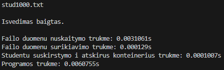

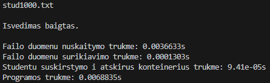
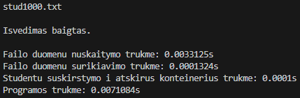

##### 10 000 įrašų

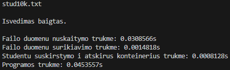

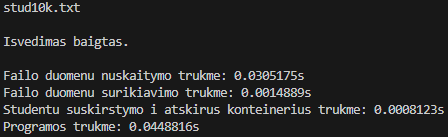

##### 100 000 įrašų

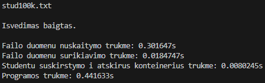
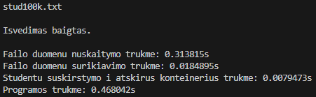

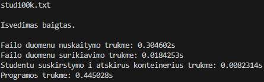

##### 1 000 000 įrašų

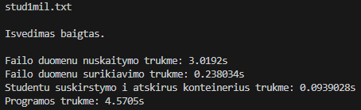
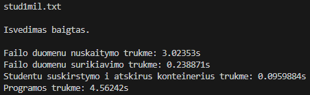
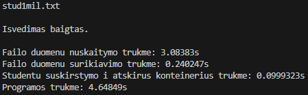

##### 10 000 000 įrašų

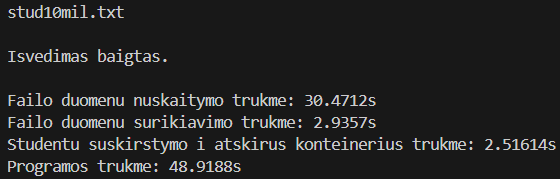

### 2. Programos versija su std::deque

##### 1 000 įrašų:

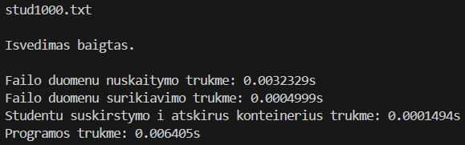
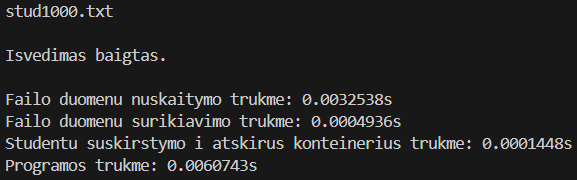
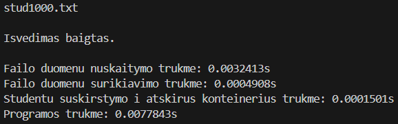

##### 10 000 įrašų:

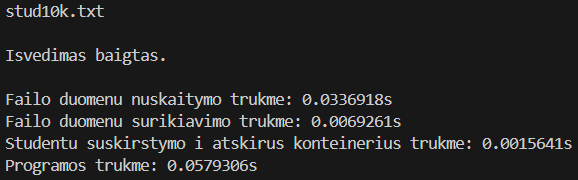
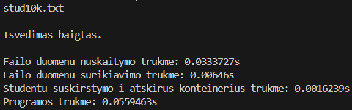
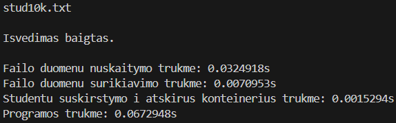
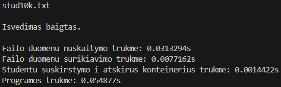
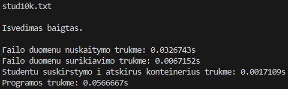

##### 100 000 įrašų:

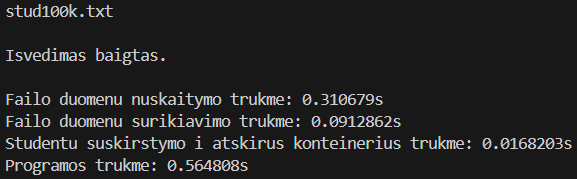
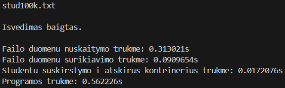
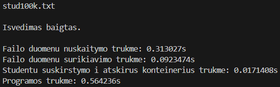
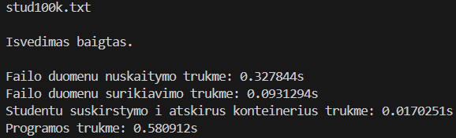
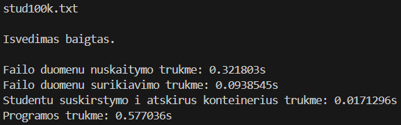

##### 1 000 000 įrašų:

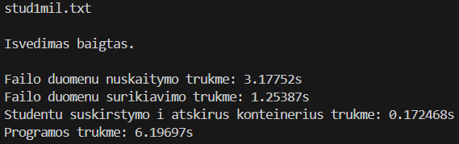
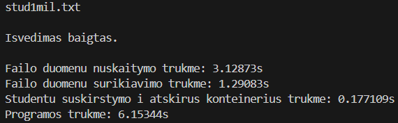
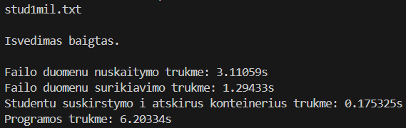
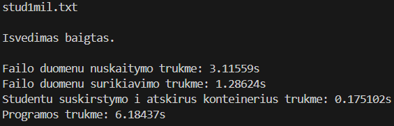
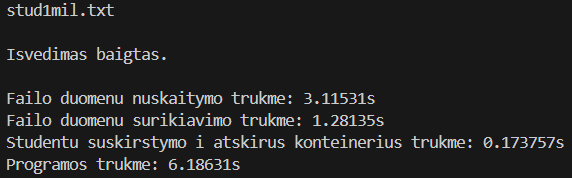

##### 10 000 000 įrašų:

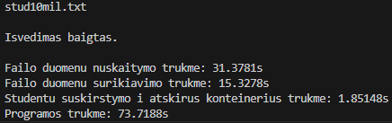
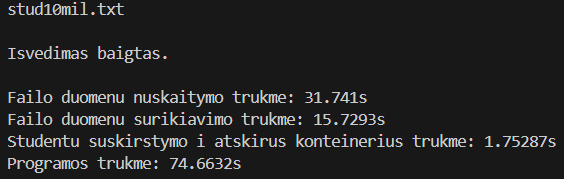
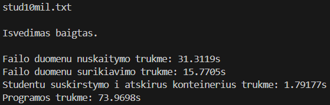
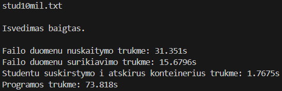
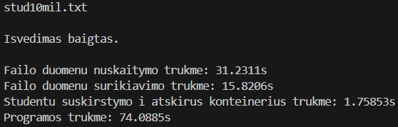

### 3. Programos versija su std::list

##### 1 000 įrašų:

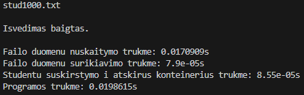
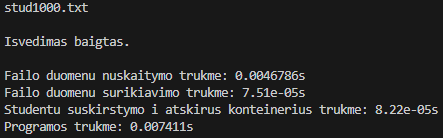
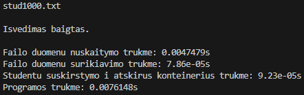
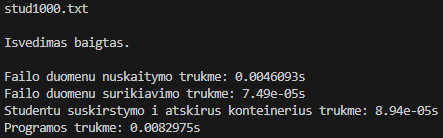
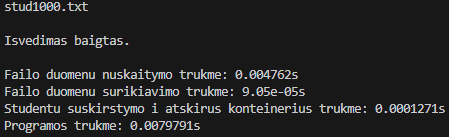

##### 10 000 įrašų:

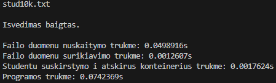
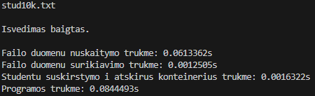
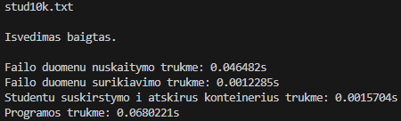
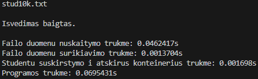
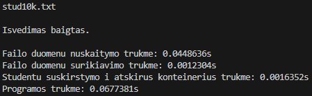

##### 100 000 įrašų:

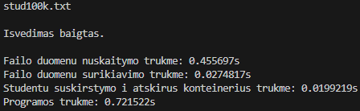
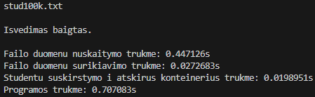
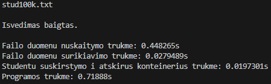
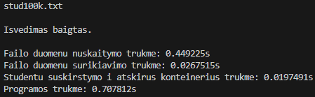
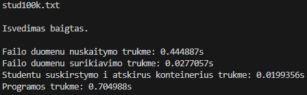

##### 1 000 000 įrašų:

##### 10 000 000 įrašų:

### Laikų vidurkiai

##### std::vector:

| Failo įrašų sk.   | 1 tūkst.   | 10 tūkst.  | 100 tūkst. | 1 mln.    | 10 mln.  |
| ----------------- | ---------- | ---------- | ---------- | --------- | -------- |
| Nuskaitymas (s)   | 0,0034203  | 0,0309502  | 0,3051384  | 3,036604  | 30,2957  |
| Surikiavimas (s)  | 0,00013062 | 0,00148628 | 0,01846376 | 0,2391284 | 2,929308 |
| Išskirstymas (s)  | 0,00009908 | 0,00081048 | 0,00806456 | 0,0992962 | 2,559528 |
| Visa programa (s) | 0,00648488 | 0,0460721  | 0,4485966  | 4,58635   | 48,77302 |

##### std::deque:

| Failo įrašų sk.   | 1 tūkst.   | 10 tūkst.  | 100 tūkst. | 1 mln.    | 10 mln.  |
| ----------------- | ---------- | ---------- | ---------- | --------- | -------- |
| Nuskaitymas (s)   | 0,0095191  | 0,032712   | 0,3172748  | 3,129548  | 31,40262 |
| Surikiavimas (s)  | 0,00049726 | 0,00698256 | 0,09231658 | 1,281324  | 15,66556 |
| Išskirstymas (s)  | 0,00014776 | 0,0015741  | 0,01706468 | 0,1747522 | 1,78443  |
| Visa programa (s) | 0,0070822  | 0,05854308 | 0,5698436  | 6,184886  | 74,05166 |

##### std::list:

| Failo įrašų sk.   | 1 tūkst.   | 10 tūkst.  | 100 tūkst. | 1 mln.    | 10 mln.  |
| ----------------- | ---------- | ---------- | ---------- | --------- | -------- |
| Nuskaitymas (s)   | 0,00717774 | 0,04976302 | 0,44904    | 4,491188  | 45,95596 |
| Surikiavimas (s)  | 0,00007962 | 0,0012681  | 0,02743122 | 0,5778892 | 10,14206 |
| Išskirstymas (s)  | 0,0000953  | 0,00165964 | 0,01984636 | 0,2471198 | 3,514694 |
| Visa programa (s) | 0,01023278 | 0,0727979  | 0,712057   | 8,099776  | 138,1736 |

Išvada: programos versija su std::vector veikia greičiausiai, su std::deque — apie 1,5 k. lėčiau, o su std::list lėčiausiai — kone 3 k. lėčiau nei su std::vector ir kone 2 k. lėčiau nei su std::deque.

## 2. strategija

### std::vector

##### 1 000 įrašų:

##### 10 000 įrašų:

##### 100 000 įrašų:

##### 1 000 000 įrašų:

##### 10 000 000 įrašų:

### std::deque

##### 1 000 įrašų:

##### 10 000 įrašų:

##### 100 000 įrašų:

##### 1 000 000 įrašų:

##### 10 000 000 įrašų:

### std::list:

##### 1 000 įrašų:

##### 10 000 įrašų:

##### 100 000 įrašų:

##### 1 000 000 įrašų:

##### 10 000 000 įrašų:

### Laikų vidurkiai

##### std::vector:

| Failo įrašų sk.   | 1 tūkst.   | 10 tūkst.  | 100 tūkst. | 1 mln.    | 10 mln.  |
| ----------------- | ---------- | ---------- | ---------- | --------- | -------- |
| Nuskaitymas (s)   | 0,00333222 | 0,03126386 | 0,3031548  | 3,005776  | 30,27776 |
| Surikiavimas (s)  | 0,00012792 | 0,00156032 | 0,01882066 | 0,2382412 | 2,881446 |
| Išskirstymas (s)  | 0,00008352 | 0,00129236 | 0.01711046 | 0,2081806 | 2,612104 |
| Visa programa (s) | 0,00596112 | 0,047184   | 0.4565372  | 4,669284  | 48,85792 |

##### std::deque:

| Failo įrašų sk.   | 1 tūkst.   | 10 tūkst.  | 100 tūkst. | 1 mln.    | 10 mln.  |
| ----------------- | ---------- | ---------- | ---------- | --------- | -------- |
| Nuskaitymas (s)   | 0,00333486 | 0,0344177  | 0,3132464  | 3,273162  | 31,23354 |
| Surikiavimas (s)  | 0,00047508 | 0,00635636 | 0,08749844 | 1,206038  | 15,1267  |
| Išskirstymas (s)  | 0,00033368 | 0,00426424 | 0,06868672 | 0,9313316 | 12,25028 |
| Visa programa (s) | 0,00685018 | 0,06109188 | 0,6170712  | 7,378868  | 85,62866 |

##### std::list:

| Failo įrašų sk.   | 1 tūkst.   | 10 tūkst.  | 100 tūkst. | 1 mln.    | 10 mln.  |
| ----------------- | ---------- | ---------- | ---------- | --------- | -------- |
| Nuskaitymas (s)   | 0,00460436 | 0,0449964  | 0,449158   | 4,473828  | 44,52716 |
| Surikiavimas (s)  | 0,00008142 | 0,00125312 | 0,02872892 | 0,5791316 | 10,27464 |
| Išskirstymas (s)  | 0,00008444 | 0,0012026  | 0,02807462 | 0,577336  | 10,86504 |
| Visa programa (s) | 0,00773628 | 0,06732566 | 0,7232514  | 8,417014  | 142,6506 |

##### Išvados:

Lyginant su 1-osios strategijos programos versija, std::vector studentų išskirstymo trukmė šiek tiek sumažėjo. Tačiau std::deque ir std::list versijų studentų išskirstymas sulėtėjo ženkliai, keliais kartais (std::deque — dar daugiau nei std::list).

## 3. strategija

3-oji studentų skirstymo strategija paremta 2-osios principu, tačiau pritaikyti algoritmai std::stable_partition, std::move, kuo mėginta pagreitinti studentų skirstymą.

### std::vector:

##### 1 000 įrašų:

##### 10 000 įrašų:

##### 100 000 įrašų:

##### 1 000 000 įrašų:

##### 10 000 000 įrašų:

### std::deque:

##### 1 000 įrašų:

##### 10 000 įrašų:

##### 100 000 įrašų:

##### 1 000 000 įrašų:

##### 10 000 000 įrašų:

...

### std::list:

##### 1 000 įrašų:

##### 10 000 įrašų:

##### 100 000 įrašų:

##### 1 000 000 įrašų:

##### 10 000 000 įrašų:

### Laikų vidurkiai:

##### std::vector:

| Failo įrašų sk.   | 1 tūkst.   | 10 tūkst.  | 100 tūkst. | 1 mln.     | 10 mln.   |
| ----------------- | ---------- | ---------- | ---------- | ---------- | --------- |
| Nuskaitymas (s)   | 0,00326928 | 0,03362434 | 0,3147096  | 3,132346   | 31,53802  |
| Surikiavimas (s)  | 0,00012584 | 0,00147244 | 0,0186556  | 0,2408318  | 2,89344   |
| Išskirstymas (s)  | 0,00006314 | 0,00056424 | 0,00716718 | 0,06777242 | 0,7116158 |
| Visa programa (s) | 0,0061401  | 0,0492335  | 0,4677638  | 4,7398     | 49,27956  |

##### std::deque:

| Failo įrašų sk.   | 1 tūkst.   | 10 tūkst.  | 100 tūkst. | 1 mln.    | 10 mln.  |
| ----------------- | ---------- | ---------- | ---------- | --------- | -------- |
| Nuskaitymas (s)   | 0,035729   | 0,03580368 | 0,3115498  | 3,105098  | 31,0364  |
| Surikiavimas (s)  | 0,00047946 | 0,0067865  | 0,09429506 | 1,232112  | 16,04648 |
| Išskirstymas (s)  | 0,00038184 | 0,00622372 | 0,07016274 | 0,7563142 | 23,24168 |
| Visa programa (s) | 0,00738288 | 0,06543044 | 0,6277952  | 6,893812  | 111,1286 |

##### std::list:

| Failo įrašų sk.   | 1 tūkst.   | 10 tūkst.  | 100 tūkst. | 1 mln.    | 10 mln.  |
| ----------------- | ---------- | ---------- | ---------- | --------- | -------- |
| Nuskaitymas (s)   | 0,00470258 | 0,04648364 | 0,445728   | 4,457746  | 44,67682 |
| Surikiavimas (s)  | 0,00008142 | 0,0012533  | 0,02947732 | 0,5856046 | 10,2377  |
| Išskirstymas (s)  | 0,0000871  | 0,00171152 | 0,0433709  | 0,5284458 | 6,609782 |
| Visa programa (s) | 0,00748806 | 0,07079574 | 0,7310016  | 8,264144  | 139,3666 |

### Išvados:

Lyginant su 2-ąja strategija:

- std::vector studentų skirstymas veikia greičiau:
  - skirtumas su 1 tūkst. įrašų: 1,3 k.
  - skirtumas su 10 tūkst. įrašų: 2,3 k.
  - skirtumas su 100 tūkst. įrašų: 2,4 k.
  - skirtumas su 1 mln. įrašų: 3,1 k.
  - skirtumas su 10 mln. įrašų: 3,7 k.
- std::deque studentų skirstymas veikia šiek tiek greičiau, nors su 10 mln. studentų — lėčiau:
  - skirtumas su 1 tūkst. įrašų: 1,1 k. greičiau
  - skirtumas su 10 tūkst. įrašų: 1,5 k. greičiau
  - skirtumas su 100 tūkst. įrašų: 1,02 k. greičiau
  - skirtumas su 1 mln. įrašų: 1,2 k. greičiau
  - skirtumas su 10 mln. įrašų: 1,9 k. lėčiau
- std::list studentų skirstymas veikia šiek tiek lėčiau su mažesniais studentų skaičiais, nors šiek tiek greičiau su didesniais studentų skaičiais:
  - skirtumas su 1 tūkst. įrašų: 1,03 k. lėčiau
  - skirtumas su 10 tūkst. įrašų: 1,4 k. lėčiau
  - skirtumas su 100 tūkst. įrašų: 1,5 k. lėčiau
  - skirtumas su 1 mln. įrašų: 1,09 k. greičiau
  - skirtumas su 10 mln. įrašų: 1,6 k. greičiau

Lyginant su 1-ąja strategija:

- std::vector studentų skirstymas veikia greičiau:
  - skirtumas su 1 tūkst. įrašų: 1,6 k.
  - skirtumas su 10 tūkst. įrašų: 1,4 k.
  - skirtumas su 100 tūkst. įrašų: 1,1 k.
  - skirtumas su 1 mln. įrašų: 1,5 k.
  - skirtumas su 10 mln. įrašų: 3,6 k.
- std::deque studentų skirstymas veikia lėčiau:
  - skirtumas su 1 tūkst. įrašų: 2,6 k.
  - skirtumas su 10 tūkst. įrašų: 4 k.
  - skirtumas su 100 tūkst. įrašų: 4,1 k.
  - skirtumas su 1 mln. įrašų: 4,3 k.
  - skirtumas su 10 mln. įrašų: 13 k.
- std::list studentų skirstymas veikia šiek tiek lėčiau arba panašiu greičiu:
  - skirtumas su 1 tūkst. įrašų: 0,91 k.
  - skirtumas su 10 tūkst. įrašų: 1,03 k.
  - skirtumas su 100 tūkst. įrašų: 2,2 k.
  - skirtumas su 1 mln. įrašų: 2,1 k.
  - skirtumas su 10 mln. įrašų: 1,9 k.

Taigi, 3-ąja strategija pavyko optimizuoti std::vector programos versijos studentų skirstymą. std::list versijos studentų skirstymo laikas išliko panašus (ar šiek tiek lėtesnis). std::deque versijos studentų skirstymas šiek tiek pagreitėjo lyginant su 2-ąja strategija, o žymiau sulėtėjo lyginant su 1-ąja strategija.
